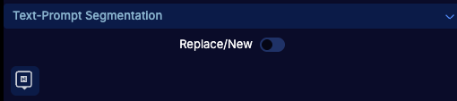
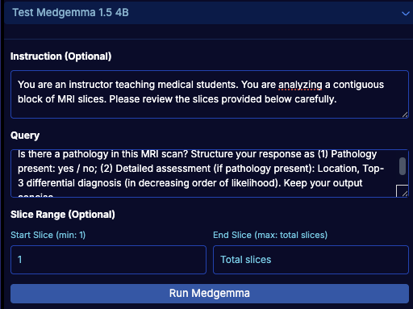

# OHIF-AI

[](https://www.docker.com/)
[](https://developer.nvidia.com/cuda-toolkit)
[](https://youtu.be/z3aq3yd-KRA)

**Interactive AI segmentation and report generation for medical imaging, directly in your browser.**

OHIF-AI brings two main capabilities into the <a href="https://ohif.org/" target="_blank">OHIF Viewer</a>:

1. **Segmentation** — Interactive AI segmentation for medical imaging using **visual prompts** (points, scribbles, lassos, bounding boxes) with models such as **nnInteractive**, **SAM2**, **MedSAM2**, and **SAM3**, or using **text prompts** with **VoxTell**. Supports iterative refinement, live inference, and 3D propagation from minimal input.
2. **Report generation** — AI-assisted radiology-style reports from 3D CT/MRI using **Medgemma 1.5**.

By combining these foundation models with the familiar OHIF interface, researchers and clinicians can perform prompt-based segmentation and generate reports without leaving the web environment.

---

## 📋 Table of Contents

- [Features](#-features)
- [Demo Video](#-demo-video)
- [Getting Started](#-getting-started)
- [Usage Guide](#-usage-guide)
  - [Segmentation](#segmentation)
    - [Visual prompts](#visual-prompts)
    - [Model selection & inference](#model-selection)
    - [Text-prompt segmentation (VoxTell)](#text-prompt-segmentation-voxtell)
  - [Report generation](#report-generation-medgemma-15-4b)
- [Keyboard Shortcuts](#-keyboard-shortcuts)
- [FAQ](#-faq)
- [How to Cite](#-how-to-cite)
- [Contributing](#-contributing)
- [Acknowledgments](#-acknowledgments)

---

## ✨ Features

**Segmentation (medical imaging)**  
- 🖱️ **Visual prompts** — Real-time segmentation with points, scribbles, lassos, and bounding boxes  
- 📝 **Text prompts (VoxTell)** — Free-form text to obtain segmentation (see [Text-prompt segmentation (VoxTell)](#text-prompt-segmentation-voxtell) for usage and important notices)  
- 🚀 **Live mode** — Automatic inference on every prompt  
- 📦 **3D propagation** — Single prompt segments the entire volume  
- 🤖 **Multiple models** — nnInteractive, SAM2, MedSAM2, SAM3, and VoxTell  

**Report generation**  
- 📄 **Medgemma 1.5 4B** — Generate radiology-style reports from 3D CT/MRI with configurable instruction, query, and slice range  

**General**  
- 🌐 **Browser-based** — No local installation; runs in the web browser

---

## 🎥 Demo Video

<a href="https://youtu.be/z3aq3yd-KRA" target="_blank">
  
</a>

Click to watch the full demonstration of OHIF-AI in action.

---

## 🚀 Getting Started

### Prerequisites

- **Docker** (v27.3.1 or later)
- **NVIDIA Container Toolkit** (v1.16.2 or later)
- **CUDA** v12.6 or compatible version
- NVIDIA GPU with appropriate drivers

### Model Checkpoints

Model checkpoints are typically downloaded automatically during setup. However, if you encounter issues with automatic downloads, you can manually download them:

**Automatically Downloaded Models:**
- **nnInteractive**: [Hugging Face](https://huggingface.co/nnInteractive/nnInteractive)
- **SAM2** (sam2.1-hiera-tiny): [Hugging Face](https://huggingface.co/facebook/sam2.1-hiera-tiny)
- **MedSAM2** (MedSAM2_latest): [Hugging Face](https://huggingface.co/wanglab/MedSAM2)
- **VoxTell**: [Hugging Face](https://huggingface.co/mrokuss/VoxTell)
- **MedGemma 1.5 4B**: [Hugging Face](https://huggingface.co/google/medgemma-1.5-4b-it) — requires your Hugging Face token (`HF_Token`) in `monai-label/monailabel/tasks/infer/basic_infer.py`

⚠️ **MedGemma VRAM:** MedGemma uses approximately **35 GB VRAM**. Either use one large GPU for all models, or allocate a **separate GPU** for MedGemma. To put MedGemma on another device (e.g. second GPU), set `device_map={"": "cuda:1"}` in `monai-label/monailabel/tasks/infer/basic_infer.py`.

**Manual Download Required:**

**SAM3 Model:**
1. Request access to the SAM3 model on [Hugging Face](https://huggingface.co/facebook/sam3)
2. Once access is granted, download the model checkpoint
3. Place the downloaded file as `sam3.pt` in the `monai-label/checkpoints/` directory

⚠️ **Note:** If the SAM3 checkpoint is not found, you will see a warning message and SAM3 will not be available for use. The application will continue to work with other models (nnInteractive, SAM2, MedSAM2, VoxTell, MedGemma 1.5 4B).


### Quick Start

1. **Clone the repository**
   ```bash
   git clone https://github.com/CCI-Bonn/OHIF-AI.git
   cd OHIF-AI
   ```

2. **Start the application**
   ```bash
   bash start.sh
   ```

3. **Access the viewer**
   
   Open your browser and navigate to: http://localhost:1026

4. **Load sample data**
   
   Upload all DICOM files from the `sample-data` directory

---

## 📖 Usage Guide

### Segmentation

OHIF-AI supports interactive segmentation in two ways: **visual prompts** (points, scribbles, lassos, bounding boxes) and **text prompts** (VoxTell). Visual prompts are described below; text-prompt segmentation (VoxTell) has its own subsection with usage and important notices.

#### Visual prompts

The tool provides four visual prompt types for segmentation (shown in red boxes from left to right):


- **Point**: Click to indicate what you want to segment  
- **Scribble**: Paint over the structure to include  
- **Lasso**: Draw around and surround the structure inside the lasso  
- **Bounding Box**: Draw a rectangular box to surround the target structure  

<a href="docs/images/all_prompts.png" target="_blank">
  
</a>

#### Model selection

Choose which segmentation model to use:

- **nnInteractive**: Supports all prompt types (point, scribble, lasso, bounding box)  
- **SAM2/MedSAM2/SAM3**: Currently supports positive/negative points and positive bounding boxes only

💡 Based on preliminary internal testing, nnInteractive provides faster inference and generally feels more real-time and accurate in typical clinical image segmentation tasks.

#### Running inference

After providing prompts and choosing the model, you can run inference by clicking the inference button located next to the red box:

**Live Mode**: To avoid manually clicking the inference button each time, enable **Live Mode**. Once enabled, the model will automatically segment the target structure on every prompt you provide.

💡 For all models, a single prompt (for example, a point or scribble on one slice) automatically propagates the segmentation across the entire 3D image stack, enabling volumetric segmentation from minimal user input.

<a href="docs/images/output.png" target="_blank">
  
</a>

#### Positive and negative prompts

You can exclude certain structures from your segmentation by toggling on the **neg.** (negative) button before providing prompts.

**Negative Scribble Example:**  
<a href="docs/images/scribble_pos_neg.png" target="_blank">
  
</a>

**Negative Point Example:**  
<a href="docs/images/point_pos_neg.png" target="_blank">
  
</a>

#### Refine vs. new segment

Use the **Refine/New** toggle to control segmentation behavior:

- **Refine**: Keep refining the current segment with additional prompts  
- **New**: Create a new, separate segment  

💡 You can revisit any existing segment at any time by selecting it from the segmentation list — once selected, new prompts will continue refining that specific segmentation interactively.

#### Text-prompt segmentation (VoxTell)

**VoxTell** is part of the segmentation workflow: it produces segmentations from **free-form text** instead of (or in addition to) visual prompts. Describe the structure or region you want to segment in natural language.

- **Replace current segment** – Use your text prompt to replace the currently selected segment.
- **Add segment label** – Create an additional segment with a new label from your text prompt.

**Notices:**

- ⚠️ **Cross-usage with nnInteractive** — Not supported yet (e.g., VoxTell → nnInteractive). Use VoxTell and nnInteractive in separate workflows.

<a href="docs/images/text_prompt.png" target="_blank">
  
</a>

**VoxTell demo:**

<a href="https://youtu.be/LsngrUz_vXk" target="_blank">
  
</a>

### Report generation (Medgemma 1.5 4B)

**Medgemma 1.5 4B** generates radiology-style reports from 3D medical images (CT/MRI). This is separate from segmentation and adds AI-assisted reporting to OHIF-AI.

- **Instruction** – Define the broad role of Medgemma (e.g., “You are a radiology assistant”) so the model follows your intended style and scope.
- **Query** – Ask specifically what you want in the report (e.g., findings, impressions, or a full report).
- **Slice range** – Specify the **slice range** of the 3D volume to include (e.g., slices 10–50) so the report is based on the relevant portion of the CT or MRI stack.

Use the Medgemma panel to set Instruction, Query, and slice range, then run inference to generate the report.

**Notice:**

- ⚠️ **GPU / VRAM** — MedGemma uses ~35 GB VRAM. Use one large GPU for all models, or a dedicated GPU for MedGemma by setting `device_map={"": "cuda:1"}` (or another device ID) in `monai-label/monailabel/tasks/infer/basic_infer.py`.

<a href="docs/images/medgemma.png" target="_blank">
  
</a>

**VoxTell + MedGemma demo:**

<a href="https://youtu.be/HU4XHAC67cQ" target="_blank">
  
</a>

---

## ⌨️ Keyboard Shortcuts

For faster workflow, you can use the following keyboard shortcuts:

**Prompt Types:**
- `a` - Point
- `s` - Scribble
- `d` - Lasso
- `f` - Bounding box

**Mode Controls:**
- `q` - Toggle Live Mode
- `w` - Toggle Positive/Negative
- `e` - Toggle Refine/New
- `r` - Run inference (if live mode off)
- `t` - Circulate nnInteractive -> SAM2 -> MedSAM2 -> SAM3

<a href="docs/images/hotkeys.png" target="_blank">
  
</a>

You can view other keyboard shortcuts and customize them in the **Settings** menu (located in the top-right corner). Select **Preferences** to access the hotkey configuration panel.

---

## ❓ FAQ

<details>
<summary><b>Load library (libnvidia-ml.so) failed from NVIDIA Container Toolkit</b></summary>

**Solution:** Reinstall Docker CE
```bash
sudo apt-get install --reinstall docker-ce
```
[Reference](https://github.com/NVIDIA/nvidia-container-toolkit/issues/305)
</details>

<details>
<summary><b>Failed to initialize NVML: Unknown Error or "No CUDA available"</b></summary>

**Solution:** Edit `/etc/nvidia-container-runtime/config.toml` and set:
```toml
no-cgroups = false
```
[Reference](https://forums.developer.nvidia.com/t/nvida-container-toolkit-failed-to-initialize-nvml-unknown-error/286219/2)
</details>

---

## 📚 How to Cite

If you use OHIF-AI in your research, please cite:

**OHIF-SAM2:**
```bibtex
@INPROCEEDINGS{10981119,
  author={Cho, Jaeyoung and Rastogi, Aditya and Liu, Jingyu and Schlamp, Kai and Vollmuth, Philipp},
  booktitle={2025 IEEE 22nd International Symposium on Biomedical Imaging (ISBI)}, 
  title={OHIF -SAM2: Accelerating Radiology Workflows with Meta Segment Anything Model 2}, 
  year={2025},
  volume={},
  number={},
  pages={1-5},
  keywords={Image segmentation;Limiting;Grounding;Foundation models;Biological system modeling;Radiology;Biomedical imaging;Web-Based Medical Imaging;Foundation Model;Segmentation;Artificial Intelligence},
  doi={10.1109/ISBI60581.2025.10981119}
}
```

**nnInteractive:**
```bibtex
@misc{isensee2025nninteractiveredefining3dpromptable,
  title={nnInteractive: Redefining 3D Promptable Segmentation}, 
  author={Fabian Isensee and Maximilian Rokuss and Lars Krämer and Stefan Dinkelacker and Ashis Ravindran and Florian Stritzke and Benjamin Hamm and Tassilo Wald and Moritz Langenberg and Constantin Ulrich and Jonathan Deissler and Ralf Floca and Klaus Maier-Hein},
  year={2025},
  eprint={2503.08373},
  archivePrefix={arXiv},
  primaryClass={cs.CV},
  url={https://arxiv.org/abs/2503.08373}
}
```

**SAM2:**
```bibtex
@misc{ravi2024sam2segmentimages,
  title={SAM 2: Segment Anything in Images and Videos}, 
  author={Nikhila Ravi and Valentin Gabeur and Yuan-Ting Hu and Ronghang Hu and Chaitanya Ryali and Tengyu Ma and Haitham Khedr and Roman Rädle and Chloe Rolland and Laura Gustafson and Eric Mintun and Junting Pan and Kalyan Vasudev Alwala and Nicolas Carion and Chao-Yuan Wu and Ross Girshick and Piotr Dollár and Christoph Feichtenhofer},
  year={2024},
  eprint={2408.00714},
  archivePrefix={arXiv},
  primaryClass={cs.CV},
  url={https://arxiv.org/abs/2408.00714}
}
```

**MedSAM2:**
```bibtex
@article{MedSAM2,
    title={MedSAM2: Segment Anything in 3D Medical Images and Videos},
    author={Ma, Jun and Yang, Zongxin and Kim, Sumin and Chen, Bihui and Baharoon, Mohammed and Fallahpour, Adibvafa and Asakereh, Reza and Lyu, Hongwei and Wang, Bo},
    journal={arXiv preprint arXiv:2504.03600},
    year={2025}
}
```

**SAM3:**
```bibtex
@misc{carion2025sam3segmentconcepts,
      title={SAM 3: Segment Anything with Concepts}, 
      author={Nicolas Carion and Laura Gustafson and Yuan-Ting Hu and Shoubhik Debnath and Ronghang Hu and Didac Suris and Chaitanya Ryali and Kalyan Vasudev Alwala and Haitham Khedr and Andrew Huang and Jie Lei and Tengyu Ma and Baishan Guo and Arpit Kalla and Markus Marks and Joseph Greer and Meng Wang and Peize Sun and Roman Rädle and Triantafyllos Afouras and Effrosyni Mavroudi and Katherine Xu and Tsung-Han Wu and Yu Zhou and Liliane Momeni and Rishi Hazra and Shuangrui Ding and Sagar Vaze and Francois Porcher and Feng Li and Siyuan Li and Aishwarya Kamath and Ho Kei Cheng and Piotr Dollár and Nikhila Ravi and Kate Saenko and Pengchuan Zhang and Christoph Feichtenhofer},
      year={2025},
      eprint={2511.16719},
      archivePrefix={arXiv},
      primaryClass={cs.CV},
      url={https://arxiv.org/abs/2511.16719}, 
}
```

**VoxTell:**
```bibtex
@misc{rokuss2025voxtell,
  title={VoxTell: Free-Text Promptable Universal 3D Medical Image Segmentation}, 
  author={Maximilian Rokuss and Moritz Langenberg and Yannick Kirchhoff and Fabian Isensee and Benjamin Hamm and Constantin Ulrich and Sebastian Regnery and Lukas Bauer and Efthimios Katsigiannopulos and Tobias Norajitra and Klaus Maier-Hein},
  year={2025},
  eprint={2511.11450},
  archivePrefix={arXiv},
  primaryClass={cs.CV},
  url={https://arxiv.org/abs/2511.11450}
}
```

**Papers:**
- [OHIF-SAM2 (IEEE ISBI 2025)](https://ieeexplore.ieee.org/document/10981119)
- [nnInteractive (arXiv)](https://arxiv.org/abs/2503.08373)
- [SAM2 (arXiv)](https://arxiv.org/abs/2408.00714)
- [MedSAM2 (arXiv)](https://arxiv.org/abs/2504.03600)
- [SAM3 (arXiv)](https://arxiv.org/abs/2511.16719)
- [VoxTell (arXiv)](https://arxiv.org/abs/2511.11450)

---

## 🤝 Contributing

Contributions are welcome! Please feel free to submit a Pull Request. For major changes, please open an issue first to discuss what you would like to change.

---

## 🙏 Acknowledgments

This project builds upon:
- [OHIF Viewer](https://ohif.org/) - Open Health Imaging Foundation Viewer
- [SAM2](https://github.com/facebookresearch/sam2) - Segment Anything Model 2 by Meta
- [nnInteractive](https://github.com/MIC-DKFZ/nnInteractive) - Interactive 3D Segmentation Framework
- [MedSAM2](https://github.com/bowang-lab/MedSAM2) - MedSAM2 by Bowang lab
- [SAM3](https://github.com/facebookresearch/sam3) - Segment Anything Model 3 by Meta
- [VoxTell](https://github.com/MIC-DKFZ/VoxTell) - Free-Text Promptable Universal 3D Medical Image Segmentation
- [MedGemma](https://github.com/Google-Health/medgemma) - Report generation from 3D medical images ([Google Research Blog](https://research.google/blog/next-generation-medical-image-interpretation-with-medgemma-15-and-medical-speech-to-text-with-medasr/))


